# 環境構築レスな React 風 UI の書き方

[@kazuma1989](https://github.com/kazuma1989/)

2020-07-16

=

## TODO リストの実装を示しながら紹介します

=

### 対象者

- ちょっとした GUI ツールを作りたい人
  - API 検証用の web ページ
  - Google Apps Script でカスタムダイアログ
- Node.js とか npm とかの環境構築が面倒な人

=

### 必要なもの

- 最新の JS 文法が動くブラウザー（IE でなければモバイル含め大体 OK）
- ローカル Web サーバー（macOS なら `python -m http.server 8000` で OK）

=

### あると嬉しい

- JS, HTML, CSS の基礎知識
- JS, HTML, CSS が書きやすいエディター（VS Code がおすすめ）

=

### いらないもの

- Node.js, npm
  - webpack, Create React App, ...
  - TypeScript

---

## まずは script import

```html
<script type="module" src="./index.js"></script>
```

`type="module"` がキー。  
こう書けば、`index.js` 内で他のファイルを import できる。

---

## index.js の中身

※
`// @ts-xxx` は VS Code で補完を効きやすくするためのもの

=

### CDN からライブラリーを import

React の亜種 ([Preact](https://preactjs.com) + [HTM](https://github.com/developit/htm)) を読み込む

- よく使う CDN -> https://unpkg.com
- unpkg が import で読み込むのに対応していない場合 -> https://cdn.pika.dev

=

### JS で HTML を書く

JS の処理で HTML をいじるなら、全部 JS で生み出せばよいのだ！

- バックティック (`) で HTML を囲む
  - JS 的にはただの文字列（ヒアドキュメント）
  - `html` という関数に文字列を渡しているだけ（正確にはちょっと違うけどこの理解で OK）

=

### JS で HTML を書く利点

- HTML 側に id を割り振って、JS からその id の要素を探し出し・・・という書き方をしなくてよくなる。
- データの流れが「アプリの状態 → HTML の表示」と単方向になるので、モデルのロジックとビューのロジックを分けることができる。

---

## 変数を埋め込む書き方

```js
const name = "Alice";

const message = `Hello, ${name}!`; // -> Hello, Alice!
```

---

## 繰り返し要素（配列）の書き方

```js
const names = ["Alice", "Bob"];

const messages = names.map((name) => `Hello, ${name}!`);
// ["Hello, Alice!", "Hello, Bob!"]
```

※
繰り返し要素に `key` 属性をつけるのはお作法

---

## 状態 (state) を持たせる

```js
// useState() の戻り値はタプル
const [currentValue, setter] = useState(initialValue);

// 新しい値を渡すか
setter(newValue);
// 新しい値を生成する関数を渡す
setter((prevValue) => {
  // ...
  return newValue;
});
```

=

### setter を呼ぶと再 render が走る



---

### TODO の完了状態をトグルする

`toggleDone` なしでもトグルできるように見えるが、画面と state に乖離が生じていろいろ不具合が起きる。

---

### 新しい TODO を追加する

---

### 新しい TODO の内容を入力する

---

## API から TODO を取得する

`useEffect` で初期表示タイミングで読み込みを開始する。



---

## スタイルを整える

[Class-less CSS Framework](https://github.com/troxler/awesome-css-frameworks#class-less) を使うと早い。

ここでは [sakura](https://oxal.org/projects/sakura/) を採用。
ダークテーマもある。
`normalize.css` も読み込むようガイドに書いてあるので、それも適用。

---

### 状態に応じてスタイルを変える

CSS も JS でコントロールする。

[emotion](https://emotion.sh/docs/emotion) を使って文字列から CSS クラス名を生成し、要素に割り当てる。
クラス名の重複を気にせず済む。

```js
const danger = css`
  color: red;
`;
// -> "css-t7boej"

const strong = css`
  font-weight: bold;
`;
cx(danger, strong); // -> "css-t7boej css-29la8v"
```

---

## (option) コンポーネントを分割する

<code>html\`~\`</code> を返す関数として切り出せば OK。

別のファイルにして import しても OK。

---

## (option) `useState`, `useEffect` を分割する

`useXxx` という名前の関数として切り出せば OK。

別のファイルにして import しても OK。
